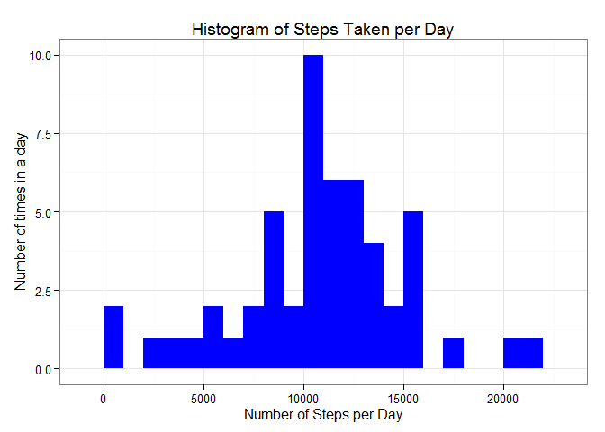
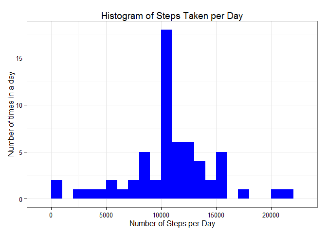

# Reproducible Research: Peer Assessment 1


## Loading and preprocessing the data
Show any code that is needed to

1. Load the data (i.e. read.csv())
2. Process/transform the data (if necessary) into a format suitable for your 
analysis


```r
library(ggplot2)
library(lattice)
url <- "https://d396qusza40orc.cloudfront.net/repdata%2Fdata%2Factivity.zip"
zip <- "activity.zip"
if(!file.exists(zip)){
	download.file(url, zip, mode="wb")
}

activityZip <- paste(getwd(), "/activiy.zip", sep = "")

if(!file.exists(activityZip)){
	unzip(zip, list = FALSE, overwrite = TRUE, exdir = ".")
}

activityMonitoringData <- read.csv("activity.csv")
```


## What is mean total number of steps taken per day?
1. Ignoring the missing values in the dataset, this histogram displays the
total number of steps taken each day.


```r
steps.date <- aggregate(steps ~ date, data = activityMonitoringData, FUN = sum,
                        na.rm = TRUE)

ggplot(steps.date, aes(x = steps)) + geom_histogram(fill = "blue", binwidth = 1000) + 
       ggtitle("Histogram of Steps Taken per Day") +
       labs(x="Number of Steps per Day",y="Number of times in a day") + theme_bw() 
```

 


2. The mean and median of the total number of steps taken per day is:

```r
mean(steps.date$steps)
```

```
## [1] 10766.19
```

```r
median(steps.date$steps)
```

```
## [1] 10765
```

## What is the average daily activity pattern?
1. Below is a time series plot (i.e. type = "l") of the 5-minute interval 
(x-axis) and the average number of steps taken, averaged across all days (y-axis).

```r
steps.interval <- aggregate(steps ~ interval, data=activityMonitoringData, FUN=mean)
plot(steps.interval, type="l")
```

 

2. The 5-minute interval, on average across all the days in the dataset, which 
contains the maximum number of steps is:

```r
steps.interval$interval[which.max(steps.interval$steps)]
```

```
## [1] 835
```


## Imputing missing values
Note that there are a number of days/intervals where there are missing values (coded as NA). 
The presence of missing days may introduce bias into some calculations or summaries of the data.

1. The total number of missing values in the dataset is:

```r
sum(is.na(activityMonitoringData))
```

```
## [1] 2304
```

2. My strategy for filling in all of the missing values in the dataset is to the mean for that 5-minute interval
   and to create a new dataset that is equal to the original dataset but with the missing data filled in.


```r
StepsIntervalMean <- aggregate(steps ~ interval, data = activityMonitoringData, FUN = mean)
imputeNA <- numeric()
for (i in 1:nrow(activityMonitoringData)) {
    activity_obs <- activityMonitoringData[i, ]
    if (is.na(activity_obs$steps)) {
        steps <- subset(StepsIntervalMean, interval == activity_obs$interval)$steps
    } else {
        steps <- activity_obs$steps
    }
    imputeNA <- c(imputeNA, steps)
}
imputed_activityMonitoringData <- activityMonitoringData
imputed_activityMonitoringData$steps <- imputeNA
```

3. Using the imputed values in the dataset, this histogram displays the
total number of steps taken each day:

```r
steps.date <- aggregate(steps ~ date, data = imputed_activityMonitoringData, FUN = sum,
                        na.rm = TRUE)

ggplot(steps.date, aes(x = steps)) + geom_histogram(fill = "blue", binwidth = 1000) + 
       ggtitle("Histogram of Steps Taken per Day") +
       labs(x="Number of Steps per Day",y="Number of times in a day") + theme_bw() 
```

 

4. The mean and median of the total number of steps taken per day, using imputed data, is:

```r
mean(steps.date$steps)
```

```
## [1] 10766.19
```

```r
median(steps.date$steps)
```

```
## [1] 10766.19
```

5. What is the impact of imputing missing data on the estimates of the total 
   daily number of steps?

   Using the imputed steps caused the median and the mean to become equal.  It also
   increased the peak of the histogram.

## Are there differences in activity patterns between weekdays and weekends?
1. To review the activity differences between weekday and weekend observations I 
   created a new factor variable that as two levels (weekday and weekend). I
   used the new imputed data.

```r
daytype <- function(date) {
    if (weekdays(as.Date(date)) %in% c("Saturday", "Sunday")) {
        "weekend"
    } else {
        "weekday"
    }
}
imputed_activityMonitoringData$daytype <- as.factor(sapply(imputed_activityMonitoringData$date, daytype))
```

2.  Below is a panel plot containing a time series plot of the 5-minute interval (x-axis) and the average 
number of steps taken, averaged across all weekday days or weekend days (y-axis). 


```r
stepsByDayType <- aggregate(steps ~ interval + daytype, data = imputed_activityMonitoringData, mean)
names(stepsByDayType) <- c("interval", "daytype", "steps")
xyplot(steps ~ interval | daytype, stepsByDayType, type = "l", layout = c(1, 2), 
    xlab = "Interval", ylab = "Number of steps")
```

 
